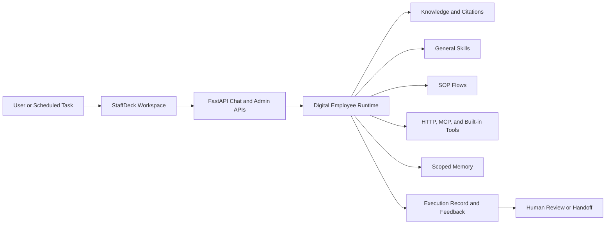

<div align="center">


# URStaff: Build, Run, and Govern Enterprise Digital Employees

**A full-stack platform for turning enterprise roles into configurable, executable, and observable digital employees.**

[English](./README.md) | [简体中文](./README.zh.md)

<p>
  <a href="#quick-start"></a>
  <a href="docs/tutorial.md"></a>
  <a href="docs/api_spec.md"></a>
  <a href="https://github.com/OpenBMB/URStaff/issues"></a>
</p>

<p>
  
  
  
  
  
</p>

</div>

URStaff is the repository behind the **StaffDeck** workspace. It combines role-specific profiles, grounded knowledge, reusable general skills, SOPs, tools, memory, scheduled work, and human intervention in one runtime. The current release provides a **bilingual web workspace**, **streaming execution records**, and a **single-port FastAPI deployment** for both chat and administration.

> This repository is private. Access to source code, Issues, and raw README URLs requires an authorized GitHub account.

## Highlights

- 🧑‍💼 **Digital employees, not generic bots** — isolate role descriptions, resources, sessions, memory, and operating records by employee.
- 📚 **Grounded enterprise knowledge** — ingest documents, retrieve relevant context, and keep citation sources attached to answers.
- 🧩 **Knowledge + general skills + SOPs** — route a request to one or more capabilities instead of forcing a single execution mode.
- 🔌 **Real tool execution** — connect HTTP, MCP, built-in, and generated skill runners to enterprise services.
- 🧠 **Persistent user memory** — capture, retrieve, review, and clear scoped memories without mixing employee or tenant data.
- ⏰ **Scheduled and queued work** — support one-time or recurring tasks and preserve queued chat turns across refreshes.
- 🔎 **Observable execution** — stream intent, routing, skill, tool, review, and response events into a per-turn execution record.
- 🤝 **Human-in-the-loop controls** — pause, cancel, hand off, review, and audit work where automation should not decide alone.
- 🔐 **Role-aware governance** — separate platform resources, creator ownership, employee access, and administrator-only operations.
- 🌐 **Bilingual StaffDeck UI** — switch the complete workspace between English and Simplified Chinese.

### Why URStaff?

The matrix describes typical out-of-the-box behavior for each product category; individual products may add some of these capabilities separately.

| Capability | Typical chatbot | RAG application | Workflow engine | **URStaff** |
| --- | :---: | :---: | :---: | :---: |
| Natural-language conversation | ✅ | ✅ | ❌ | ✅ |
| Knowledge retrieval with visible citations | ❌ | ✅ | ❌ | ✅ |
| Reusable general skills and SOP execution | ❌ | ❌ | ✅ | ✅ |
| External tools and service actions | ❌ | ❌ | ✅ | ✅ |
| Persistent employee identity and memory | ❌ | ❌ | ❌ | ✅ |
| Scheduled autonomous work | ❌ | ❌ | ✅ | ✅ |
| Streaming per-turn execution record | ❌ | ❌ | ✅ | ✅ |
| Human handoff, cancellation, and review | ❌ | ❌ | ✅ | ✅ |
| Creator ownership and role-aware management | ❌ | ❌ | ✅ | ✅ |

## News

- 📌 **Pinned · 2026-07-13** — The first private GitHub release of URStaff packages the StaffDeck workspace, bilingual UI, digital employee runtime, and one-port deployment. Start with the [first demo](#quick-start).

## Demo

After starting the service, the complete experience is available locally:

| Entry | URL | What to try |
| --- | --- | --- |
| Digital Employee Marketplace | [http://127.0.0.1:5173/workspace/gallery](http://127.0.0.1:5173/workspace/gallery) | Select an employee and start a session |
| Chat Workspace | `http://127.0.0.1:5173/workspace/chat/<session_id>` | Inspect streaming execution records and citations |
| Enterprise Console | [http://127.0.0.1:5173/enterprise/dashboard](http://127.0.0.1:5173/enterprise/dashboard) | Configure employees, knowledge, skills, SOPs, tools, and tasks |
| API Explorer | [http://127.0.0.1:5173/docs](http://127.0.0.1:5173/docs) | Call and inspect the FastAPI endpoints |

## Agent-Friendly Quick Deploy

Paste the prompt below into an authenticated coding agent such as Cursor, Claude Code, or Codex:

```text
Read https://raw.githubusercontent.com/OpenBMB/URStaff/main/README.md.
Clone the private OpenBMB/URStaff repository, prepare Python 3.11 and Node.js 20,
create backend/.venv, install the backend and frontend dependencies, copy
backend/.env.example to backend/.env, ask me for the OpenAI-compatible model
endpoint and API key if they are missing, run DETACH=1 scripts/dev_up.sh, and
verify /api/health plus /workspace/gallery before reporting success.
Do not expose credentials or change the repository visibility.
```

The raw URL requires GitHub authentication because this repository is private.

## Table of Contents

- [Quick Start](#quick-start)
- [Configuration](#configuration)
- [Architecture](#architecture)
- [Core Workflows](#core-workflows)
- [Project Structure](#project-structure)
- [Development and Validation](#development-and-validation)
- [FAQ](#faq)
- [Roadmap](#roadmap)
- [Contributing](#contributing)
- [Risks and Limitations](#risks-and-limitations)
- [Citation](#citation)
- [License](#license)
- [Acknowledgments](#acknowledgments)

## Quick Start

### Requirements

- macOS, Linux, or WSL for the development scripts
- Python **3.11+**
- Node.js **20+** and npm
- An OpenAI-compatible Chat Completions endpoint and API key
- No CUDA requirement for the application itself; model hardware is managed by your chosen model provider

### 1. Clone and install

```bash
git clone https://github.com/OpenBMB/URStaff.git
cd URStaff

python3.11 -m venv backend/.venv
backend/.venv/bin/python -m pip install -e "backend[dev]"
npm --prefix frontend-enterprise ci
cp backend/.env.example backend/.env
```

### 2. Configure a model

Edit `backend/.env` before the first startup:

```dotenv
APP_SECRET="replace-with-a-long-random-secret"
DEMO_MODEL_BASE_URL="https://your-openai-compatible-endpoint/v1"
DEMO_MODEL_NAME="your-model-name"
DEMO_MODEL_API_KEY="your-api-key"
```

The API key is used to seed the initial model configuration and is encrypted before database storage. Keep `backend/.env` out of version control. You can also configure providers later from **Admin → Model Configuration**.

### 3. Launch the Web demo

```bash
DETACH=1 scripts/dev_up.sh
```

The script builds the StaffDeck frontend and serves the UI, API, and Swagger documentation from one FastAPI process on port `5173`.

### 4. Verify the installation

```bash
curl http://127.0.0.1:5173/api/health
```

Expected output:

```json
{"status":"ok"}
```

Open [http://127.0.0.1:5173/workspace/gallery](http://127.0.0.1:5173/workspace/gallery), select a digital employee, and send the first message. The assistant answer and its execution record should stream into the same turn.

### Useful commands

```bash
scripts/dev_status.sh       # inspect running services
scripts/dev_down.sh         # stop the local stack
scripts/dev_up.sh           # run in the foreground
SINGLE_PORT=0 scripts/dev_up.sh  # split frontend/backend mode for UI debugging
```

For focused backend debugging:

```bash
cd backend
.venv/bin/uvicorn single_port_app:app --host 127.0.0.1 --port 5173
```

> Full walkthrough → [StaffDeck tutorial](docs/tutorial.md)

## Configuration

Important environment variables are documented in [`backend/.env.example`](backend/.env.example).

| Variable | Purpose | Default |
| --- | --- | --- |
| `APP_SECRET` | Encrypts stored provider credentials; replace it outside local development | `change-me-in-development` |
| `DEMO_MODEL_BASE_URL` | OpenAI-compatible API base URL used for initial model seeding | Demo endpoint |
| `DEMO_MODEL_NAME` | Initial model identifier | `qwen3.6-27b` |
| `DEMO_MODEL_API_KEY` | Optional key for initial model seeding | Empty |
| `TOOL_TIMEOUT_SECONDS` | HTTP tool timeout | `8` |
| `GENERAL_SKILL_RUNTIME_PYTHON` | Prepared Python used by generated general-skill runners | Auto-detected |
| `GENERAL_SKILL_RUNTIME_PACKAGES` | Packages verified or installed in the isolated skill runtime | `requests,httpx` |

URStaff supports configurable OpenAI-compatible providers rather than bundling model weights. Provider limits, context windows, multimodal support, and hardware requirements therefore depend on the selected model service.

## Architecture



A chat turn is stored as a stable turn block. Routing may select knowledge and reusable capabilities together, while the execution stream records each observable decision, action, review, and response event. Scheduled tasks reuse the same runtime and persist their own run records.

## Core Workflows

1. **Create a digital employee** — define the position, role boundary, service style, creator, and access scope.
2. **Attach capabilities** — copy or create knowledge bases, general skills, SOPs, and tools without modifying marketplace originals.
3. **Start a session** — use the marketplace or employee roster; the session becomes persistent after the first message.
4. **Run and observe** — follow streaming intent, retrieval, skill, tool, review, and response events in the execution record.
5. **Intervene when needed** — queue another request, cancel a run, hand it to a person, or review a pending answer.
6. **Operate continuously** — use memory, feedback, conversation logs, and scheduled tasks to improve the employee over time.

## Project Structure

```text
URStaff/
├── backend/                  # FastAPI APIs, agent runtime, persistence, workers
├── frontend-enterprise/      # React/TypeScript StaffDeck workspace
├── docs/                     # Tutorial, API, schemas, and example flows
├── scripts/                  # Single-port lifecycle and validation scripts
├── packaging/                # macOS, Linux, and Windows packaging assets
└── README.md                 # English project guide
```

## Development and Validation

```bash
# Backend tests
cd backend
.venv/bin/python -m pytest tests

# Frontend i18n and production build
cd ../frontend-enterprise
npm run i18n:check
npm run build
```

For UI changes, validate the real mounted routes under `/workspace/*` and `/enterprise/*`; do not test components only in isolation.

## FAQ

<details>
<summary><strong>The UI opens, but the employee does not answer.</strong></summary>

Verify the selected model configuration, API key, provider network access, and model name. Then inspect the execution record and backend log under `.dev/logs/app.log` for the exact provider error.
</details>

<details>
<summary><strong>Port 5173 is already in use.</strong></summary>

Run `scripts/dev_down.sh`. If the listener is not managed by URStaff, inspect it first, then run `FORCE_PORTS=1 scripts/dev_up.sh` only when it is safe to stop.
</details>

<details>
<summary><strong>Can URStaff run without a local GPU?</strong></summary>

Yes. The application calls an OpenAI-compatible model endpoint. GPU requirements belong to the model service you choose to host or consume.
</details>

<details>
<summary><strong>Why can a user use a marketplace resource but not edit it?</strong></summary>

Marketplace resources are reusable templates. Non-administrators can copy or attach authorized resources to their employees, while the original resource remains protected by creator and administrator permissions.
</details>

## Roadmap

- [ ] Official container image and Docker Compose deployment
- [ ] Public documentation site and versioned API reference
- [ ] Reproducible quality, latency, and task-completion benchmarks
- [ ] More enterprise connectors and reviewed marketplace resources
- [ ] Expanded approval policies for high-risk tool actions

Priorities are driven by real deployments. Open an [Issue](https://github.com/OpenBMB/URStaff/issues) with a reproducible scenario and expected behavior.

## Contributing

Contributions from authorized collaborators are welcome:

- Report reproducible bugs and permission issues
- Propose employee, knowledge, skill, SOP, or tool workflows
- Submit focused pull requests with tests and browser validation
- Improve documentation and Chinese/English translations

Keep unrelated worktree changes intact, add tests proportional to the affected behavior, and include the routes and user roles used for UI verification.

## Risks and Limitations

- Model outputs can be incorrect, incomplete, or inconsistent; execution records improve auditability but do not guarantee correctness.
- Retrieved knowledge is limited by document quality, parsing, indexing, permissions, and the selected model.
- External tools and generated runners can have real side effects. Use least-privilege credentials and require human approval for high-risk actions.
- Scheduled tasks depend on a continuously running worker and correctly configured user time zones.
- This project is not a substitute for legal, medical, financial, security, or other regulated professional review.
- Do not use the platform to process data or automate decisions without appropriate authorization, privacy controls, and human oversight.

## Citation

If you use URStaff in internal research or an authorized publication, cite the software as:

```bibtex
@software{urstaff2026,
  title  = {URStaff: Build, Run, and Govern Enterprise Digital Employees},
  author = {OpenBMB},
  year   = {2026},
  url    = {https://github.com/OpenBMB/URStaff}
}
```

## License

No public open-source license is currently granted. This private repository and its contents may only be used by authorized users under the applicable organizational agreement.

## Acknowledgments

URStaff is developed within the [OpenBMB](https://www.openbmb.cn/) ecosystem. Its README structure follows the concise, demo-first presentation used by [PilotDeck](https://github.com/OpenBMB/PilotDeck). Thanks to the open-source communities behind FastAPI, React, Vite, SQLModel, Pydantic, and the OpenAI-compatible API ecosystem.
